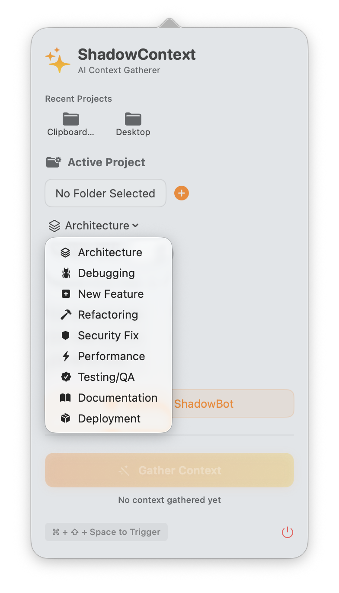
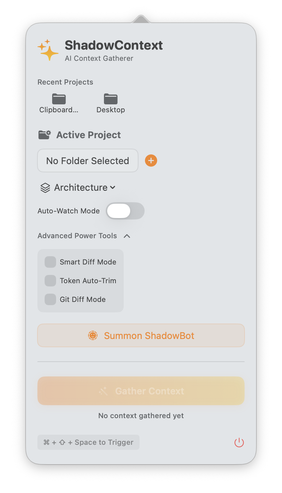
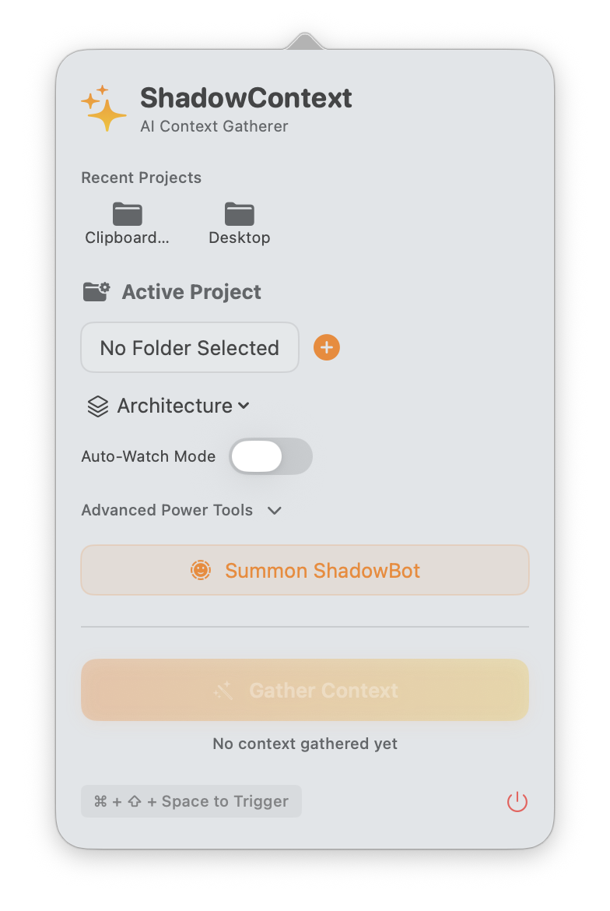

# 🌙 ShadowContext

### *The Stealthiest AI Context Gatherer for macOS*

**ShadowContext** is a professional-grade, high-performance menu bar application designed to bridge the gap between your local codebase and AI coding assistants. Built with **Swift** and **SwiftUI**, it provides a seamless, "always-there" experience for gathering, filtering, and optimizing context for your AI workflows.

## 📸 Visual Walkthrough

<p align="center">
  
  
  
</p>

---

## 🚀 Key Features

- **⚡️ Global Hotkey Access**: Trigger context gathering anywhere with `Cmd + Shift + Space`.
- **🕵️‍♂️ Stealth Mode**: Runs entirely in the macOS menu bar as a lightweight agent. No dock icon, no clutter.
- **🤖 ShadowBot**: A floating AI assistant layer specifically optimized for Git/GitHub workflows and natural language project management.
- **🛠 Git-Smart Context**: Automatically fetches branch information, staged/unstaged diffs, and project metadata to provide high-fidelity context with minimal tokens.
- **🔍 Context Preview**: See exactly what you're sending to your AI before you copy or pipe it.
- **📂 Project Management**: Track and manage multiple recent projects with ease.
- **🎯 Token Optimization**: Intelligent filtering to ensure you only send the most relevant information, saving time and API costs.

---

## 🛠 Installation & Setup

### Prerequisites
- macOS 13.0+
- Xcode 15.0+ (for building from source)

### Quick Start
1.  **Clone the repository**:
    ```bash
    git clone https://github.com/your-username/macos_application_open-source.git
    cd macos_application_open-source
    ```
2.  **Open in Xcode**: Open the `ShadowContext` directory and find the `.xcodeproj`.
3.  **Configure Sandbox**: Ensure "User Selected Files" is set to `Read/Write` in Signing & Capabilities.
4.  **Build and Run**: Hit `Cmd + R` and look for the sparkles (✨) icon in your menu bar.

> [!IMPORTANT]
> For a detailed walkthrough on setting up the project structure and configuring macOS agent settings, please refer to the [Xcode Setup Guide](ShadowContext/setup_guide.md).

---

## 📖 Usage

### Triggering Context
Simply press `Cmd + Shift + Space` or click the menu bar icon. ShadowContext will analyze your current project and prepare a context report including:
- Current branch and remote info.
- Recent Git diffs.
- Active file structures.

### ShadowBot Assistant
Click the **ShadowBot** action in the menu bar to summon a floating panel. ShadowBot is trained to help you with:
- Explaining complex Git diffs.
- Drafting commit messages.
- Analyzing project structure via natural language.

---

## 🏗 Technology Stack

- **Language**: Swift 5.10
- **Framework**: SwiftUI / AppKit
- **Architecture**: MVVM + Service-Oriented Logic
- **Automation**: Custom shell scripts for asset generation and builds.

---

## 🤝 Contributing

This is an **Open Source** project and we welcome contributions! Whether it's a bug fix, a new feature, or documentation improvements:

1. Fork the repo.
2. Create a feature branch (`git checkout -b feature/amazing-feature`).
3. Commit your changes (`git commit -m 'Add amazing feature'`).
4. Push to the branch (`git push origin feature/amazing-feature`).
5. Open a Pull Request.

---

## 📜 License

Distributed under the **MIT License**. See `LICENSE` (if available) for more information.

---

*Built with ❤️ for the AI-Assisted Developer community.*
